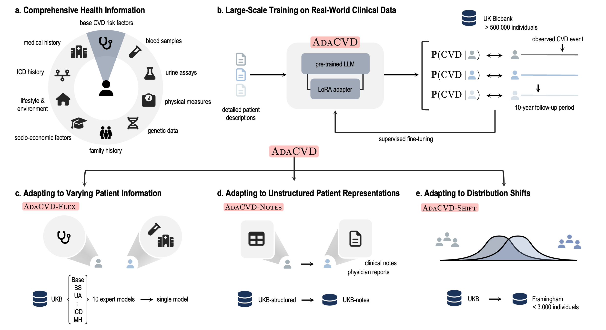

# `AdaCVD` — Adaptable Cardiovascular Disease Risk Prediction from Heterogeneous Data using Large Language Models

**Authors:** Frederike Lübeck, Jonas Wildbeger, Frederik Träuble, Maximilian Mordig, Sergios Gatidis, Andreas Krause, Bernhard Schölkopf

The preprint is available on [ArXiv](https://arxiv.org/abs/2505.24655).



Cardiovascular disease (CVD) risk prediction models are essential for identifying high-risk individuals and guiding preventive actions. However, existing models struggle with the challenges of real-world clinical practice as they oversimplify patient profiles, rely on rigid input schemas, and are sensitive to distribution shifts. We developed `AdaCVD`, an adaptable CVD risk prediction framework built on large language models extensively fine-tuned on over half a million participants from the UK Biobank. In benchmark comparisons, `AdaCVD` surpasses established risk scores and standard machine learning approaches, achieving state-of-the-art performance. Crucially, for the first time, it addresses key clinical challenges across three dimensions: it flexibly incorporates comprehensive yet variable patient information; it seamlessly integrates both structured data and unstructured text; and it rapidly adapts to new patient populations using minimal additional data. In stratified analyses, it demonstrates robust performance across demographic, socioeconomic, and clinical subgroups, including underrepresented cohorts. `AdaCVD` offers a promising path toward more flexible, AI-driven clinical decision support tools suited to the realities of heterogeneous and dynamic healthcare environments.

This repository contains the code to train the `AdaCVD` model and all baselines.

## Installation

This project uses `micromamba` — a fast, minimal installer for `conda` environments. It's a lightweight alternative to `conda` that supports the same environment and package management commands. If you're already using `conda`, you can adapt the steps accordingly, but we recommend `micromamba` for faster setups. If you don’t have `micromamba` installed, follow the [official installation guide](https://mamba.readthedocs.io/en/latest/installation/micromamba-installation.html).

### 1. Create and Activate the Environment

```bash
micromamba create -n adacvd python=3.10
micromamba activate adacvd
```

### 2. Install PyTorch with CUDA Support

```bash
micromamba install pytorch torchvision torchaudio pytorch-cuda=12.1 -c pytorch -c nvidia
```
> Adjust `pytorch-cuda=12.1` if your system uses a different CUDA version.

### 3. Install Remaining Dependencies

```bash
micromamba install -f environment.yaml
```

### 4. Verify CUDA Availability

```bash
python -c "import torch; assert torch.cuda.is_available()"
```

### 5. Install the Project in Editable Mode

```bash
pip install -e .
```

## Data

This project uses data from the UK Biobank. We provide code for processing the UK Biobank into meaningful representations that can be used for model training. For a detailed description of data preprocessing, see [`data_docuentation/ukb_data_preparation.md`](data_documentation/ukb_data_preparation.md). 

> Note: Access to UK Biobank data requires institutional approval.

## Model Training

Training the model involves fine-tuning the `Mistral-7B-Instruct` model with a LoRA adapter. Efficient training therefore requires a GPU compute node with approximately $\geq 50$ GB of memory. All training was done on an NVIDIA A100-SXM4-80GB with 8 GPU cores. 

To start model training, use the following command:

```bash
accelerate launch adacvd/training/train_model.py --train_dir={base_dir} --device=cuda
```

Replace `{base_dir}` with the path to your training directory containing the configuration file (such as [`config/training/train_settings.yaml`](config/training/train_settings.yaml)). All model checkpoints and predictions will be stored in this directory.

> Note: `accelerate launch` enables multi-GPU training when multiple GPUs are available.

## Baselines

To train the baseline models, use the following command:

```bash
python exploration/ml_baselines/train_ml_baseline.py --model lgbm --config config/training/train_settings.yaml
```

Adjust the model or config file depending on which model you want to train.

The medical risk scores are implemented in [`adacvd/risk_scores`](adacvd/risk_scores).

## Evaluation

To compute the bootstrapped evaluation metrics for a prediciton file, run the following command:

```bash
python exploration/evaluation/evaluation.py --prediction_dir={prediction_dir} --eval_dir={eval_dir} --evaluation_subset={evaluation_subset} --target MACE_ADO_EXTENDED_10y"
```

- `prediction_dir`: Path to the directory containing the models' predictions for the evaluation set (`evals.csv`)
- `eval_dir`: Path to a directory where the evaluation results will be stored.
- `evaluation_subset`: Path to the evaluation subset, which contains the eids of all participants that should be included in the evaluation.
- `target`: Outcome variable that should be used for the evaluation.

## Citation
In case you found our work useful, please consider citing us:

```
@misc{lübeck2025adaptablecardiovasculardiseaserisk,
      title={Adaptable Cardiovascular Disease Risk Prediction from Heterogeneous Data using Large Language Models}, 
      author={Frederike Lübeck and Jonas Wildberger and Frederik Träuble and Maximilian Mordig and Sergios Gatidis and Andreas Krause and Bernhard Schölkopf},
      year={2025},
      eprint={2505.24655},
      archivePrefix={arXiv},
      primaryClass={cs.AI},
      url={https://arxiv.org/abs/2505.24655}, 
}
```
